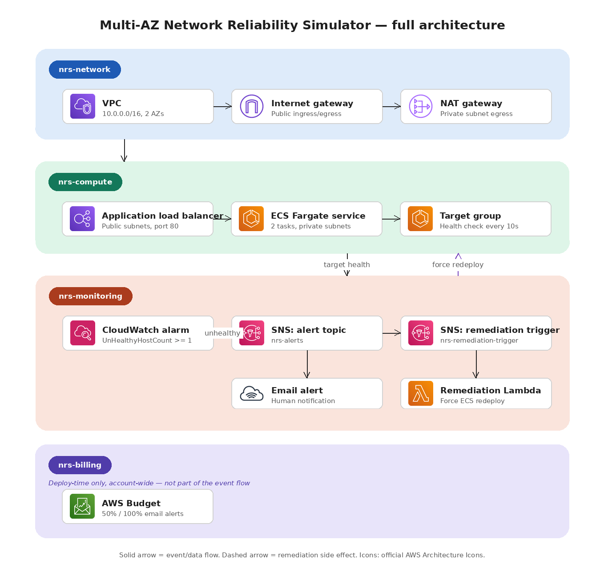

# Multi-AZ Network Reliability Simulator

*Learning project #1 in a series — AWS / SRE fundamentals.*

A self-healing AWS network architecture that detects connectivity failures
and automatically remediates them — built to practice SRE concepts
(detection → alerting → auto-remediation → observability) grounded in
enterprise networking fundamentals (VPC design, security groups, load
balancing, multi-AZ redundancy).

## About this series

First in a series of hands-on AWS learning projects, built right after
passing SAA-C03 to go deeper through practice rather than more theory.
Upcoming topics: ML on AWS, cloud security, migration scenarios. Same
approach each time — build a real scenario, break it, watch it recover,
document what actually happened, bugs included.

## Who did what

Built with AI assistance, not from scratch — being upfront about it. AI
wrote the CloudFormation templates, the failure-injection script, and this
README. I made the architecture calls (e.g. CloudFormation over Terraform,
no prior Terraform experience), deployed everything by hand in the AWS
Console, ran the failure test, read the logs, and caught a real bug myself
(alarm never fired — traced to `Period: 30` vs. ALB's 1-minute metric
granularity). Afterward I went through the templates line by line with AI
until I could explain each part myself, checked against official AWS docs.
This is how I'd use AI on the job: as an accelerant, not a black box.

## Why this project

20+ years in enterprise networking (Huawei / Cisco / Juniper), AWS SAA-C03
certified. This project bridges that background with SRE practice: instead
of just describing "highly available architecture," it **breaks itself on
demand and proves it recovers**, with a full audit trail (CloudWatch Alarm
history, Lambda logs, SNS notifications).

## Architecture



**Components:**
- **Network layer** — VPC across 2 AZs, public/private subnets, IGW, NAT Gateway
- **Compute layer** — ALB + ECS Fargate service (2 tasks, one per AZ)
- **Monitoring layer** — CloudWatch Alarm on `UnHealthyHostCount`, dual SNS
  topics (human alert + remediation trigger), Lambda that forces an ECS
  service redeployment when triggered
- **Failure injection** — a Python/boto3 script that revokes the ECS
  security group's ingress rule to simulate a connectivity failure, then
  restores it automatically

All infrastructure is defined as CloudFormation templates (nested via stack
exports/imports) — no manual console configuration.

## How the demo works

1. Deploy the stacks (see below)
2. Run `scripts/simulate_failure.py` — it revokes the ingress rule that lets
   the ALB reach the ECS tasks
3. Watch the failure cascade in real time:
   - ALB marks targets unhealthy
   - CloudWatch Alarm transitions `OK → In alarm` (after 2 consecutive
     unhealthy datapoints, ~2 min)
   - SNS notifies via email and triggers the remediation Lambda
   - Lambda calls `ecs update-service --force-new-deployment`, replacing
     the affected tasks
   - ECS's own health-check-driven task replacement also kicks in
     independently, adding a second layer of resilience
4. The script restores the ingress rule automatically when the observation
   window ends

See `screenshots/` for a captured run, including the CloudWatch Alarm
history showing the full `OK → In alarm` transition with both SNS actions
firing.

## Deployment

Stacks must be deployed in order (each imports values exported by the
previous one via `ProjectName`, default `nrs`):

```bash
aws cloudformation deploy --template-file cloudformation/network.yaml \
  --stack-name nrs-network --region eu-west-3

aws cloudformation deploy --template-file cloudformation/billing-alarm.yaml \
  --stack-name nrs-billing --region eu-west-3 \
  --parameter-overrides AlertEmail=you@example.com

aws cloudformation deploy --template-file cloudformation/compute.yaml \
  --stack-name nrs-compute --region eu-west-3 \
  --capabilities CAPABILITY_NAMED_IAM

aws cloudformation deploy --template-file cloudformation/monitoring.yaml \
  --stack-name nrs-monitoring --region eu-west-3 \
  --parameter-overrides AlertEmail=you@example.com \
  --capabilities CAPABILITY_NAMED_IAM
```

Then run the failure simulation:

```bash
pip install boto3
python scripts/simulate_failure.py --outage-seconds 180
```

## Cost awareness

Estimated cost for a few hours of testing: **under $1**. The main ongoing
cost driver if left running is the **NAT Gateway** (~$32/month if not torn
down). A `billing-alarm.yaml` stack sets up an AWS Budget with email alerts
at 50%/100% of a configurable monthly threshold as a safety net.

**Tear down after testing:**
```bash
aws cloudformation delete-stack --stack-name nrs-monitoring
aws cloudformation delete-stack --stack-name nrs-compute
aws cloudformation delete-stack --stack-name nrs-billing
aws cloudformation delete-stack --stack-name nrs-network
```

## Lessons learned / debugging notes

- **CloudFormation cross-stack exports** are named after the `ProjectName`
  parameter, not the stack name — a mismatch here caused an early
  `ROLLBACK_IN_PROGRESS` failure.
- **ALB metrics publish at 1-minute granularity.** An initial `Period: 30`
  on the CloudWatch Alarm silently broke the "2 consecutive breaching
  datapoints" logic — every other period had no data, and
  `TreatMissingData: notBreaching` meant the alarm never accumulated 2
  consecutive breaches. Fixed by aligning `Period` to 60s.
- **ARN parsing for CloudWatch alarm dimensions** differs between Target
  Group and Load Balancer ARNs — the LoadBalancer dimension requires
  stripping the `loadbalancer/` prefix that the raw ARN segment includes.

## Stack

AWS (VPC, ALB, ECS Fargate, CloudWatch, SNS, Lambda, Budgets) · CloudFormation · Python (boto3)

## Roadmap

- [ ] Rewrite infrastructure in Terraform
- [ ] Multi-VPC topology via Transit Gateway (second layer of network
      complexity closer to real multi-region/multi-account setups)
- [ ] CloudWatch Dashboard combining latency, healthy/unhealthy host count,
      and Lambda invocation metrics in one view
